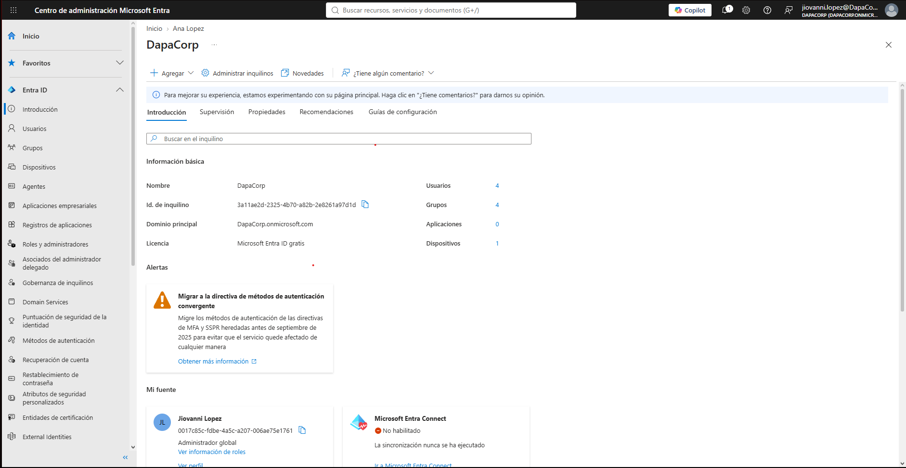

# Módulo 1: Gestión de Identidades y Accesos (IAM) con Microsoft Entra ID & M365

## Descripción del Módulo
Este módulo documenta las actividades de administración de identidades, gestión del ciclo de vida de usuarios y resolución de incidentes de acceso dentro de un entorno empresarial de **Microsoft 365** y **Microsoft Entra ID** (anteriormente Azure Active Directory).

El objetivo es simular el trabajo diario de un técnico de Help Desk L1 al aprovisionar cuentas corporativas, asignar licencias, gestionar grupos de seguridad y atender solicitudes de restablecimiento de credenciales.

---

## Entorno y Tecnologías Utilizadas
* **Inquilino Corporativo (Tenant):** `DapaCorp.onmicrosoft.com`
* **Licenciamiento:** Microsoft 365 Empresa Premium (Versión de evaluación)
* **Plataformas de Administración:**
  * Centro de administración de Microsoft 365 (`admin.cloud.microsoft`)
  * Centro de administración de Microsoft Entra (`entra.microsoft.com`)

---

## Actividades y Procedimientos Ejecutados

### 1. Despliegue y Configuración del Tenant Empresarial
* Configuración inicial de la organización corporativa ficticia **DapaCorp**.
* Configuración del dominio raíz para el aprovisionamiento de cuentas de correo y recursos en la nube.

### 2. Aprovisionamiento y Gestión del Ciclo de Vida de Usuarios
* Creación de cuentas de usuario finales con naming conventions corporativos (ej. `alopez@DapaCorp.onmicrosoft.com`).
* Asignación de licencias empresariales (Microsoft 365 Business Premium).
* Configuración de propiedades de usuario, roles iniciales y estado de la cuenta.

* Creación del grupo de seguridad **`Soporte-TI-L1`**.
* Asignación de tipo de pertenencia y agregación de miembros para la gestión centralizada de permisos y accesos a recursos corporativos.

### 4. Flujo de Atención a Incidente: Restablecimiento de Credenciales
* **Escenario:** La usuaria *Ana López* reporta imposibilidad de acceso a su cuenta corporativa por olvido de contraseña.
* **Procedimiento:**
  1. Identificación y búsqueda de la cuenta de usuario en el panel de Microsoft Entra ID.
  2. Ejecución de restablecimiento de contraseña (*Self-Service Password Reset / Admin Reset*).
  3. Generación de clave temporal de inicio de sesión.
  4. Habilitación de la directiva de **cambio de contraseña obligatorio en el primer inicio de sesión**.
  5. Validacion exitosa del flujo desde el portal del usuario (`login.microsoftonline.com`).

---

## 🎯 Competencias Demostradas
* **Gestión IAM (Identity & Access Management):** Alta, baja y modificación de cuentas de usuario en entornos nube de Microsoft.
* **Seguridad de Accesos:** Gestión de políticas de contraseñas y mitigación de bloqueos de cuenta.
* **Control de Accesos Basado en Roles (RBAC):** Uso de grupos de seguridad para simplificar la asignación de permisos.

---

## 📸 Evidencia de Pruebas (Screenshots)

| Módulo / Caso de Uso | Captura de Pantalla |
| :--- | :--- |
| **Panel de Microsoft Entra ID** | `` |
| **Creación de Grupo de Seguridad** | `` |
| **Restablecimiento de Contraseña** | `` |
| **Validación Primer Inicio de Sesión** | `` |
