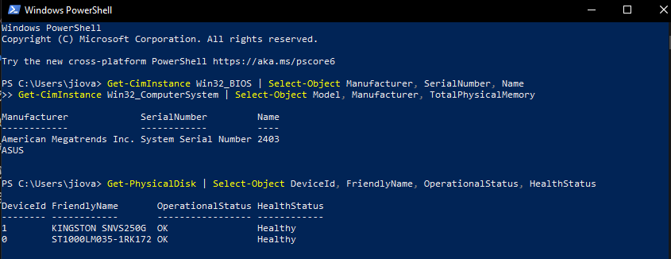
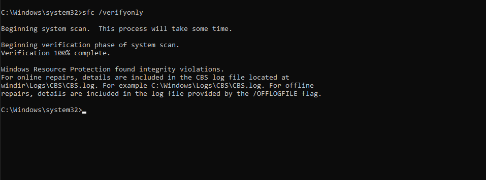
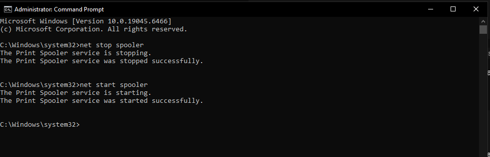

# Módulo 4: Soporte de Hardware, Impresoras e Inventario de Activos de TI

## Descripción del Módulo
Este módulo documenta los procedimientos de soporte de **primer nivel (N1)** asociados al parque informático: diagnóstico y reemplazo de componentes de hardware, configuración de impresoras locales y de red, control de periféricos, y mantenimiento de la **base de datos de inventario de activos de TI**.

El objetivo es simular las tareas recurrentes de un técnico de mesa de ayuda cuando un usuario reporta equipo lento, falla de impresión o recibe un equipo nuevo: desde el diagnóstico por componentes hasta la entrega formal del activo con su registro actualizado.

> **Estado:** este README es la estructura y el guion de procedimientos. Completa cada sección con tus ejecuciones reales y agrega las capturas en `screenshots/` antes de publicarlo.

---

## Entorno y Tecnologías Utilizadas
* **Laboratorio virtual:** VirtualBox con VM Windows 10/11 y VM Ubuntu Server
* **Inventario:** hoja de cálculo de control con campos de ticket, alta, baja y estado
* **Herramientas de descubrimiento y diagnóstico:**
  * Inventario de hardware por CLI (`systeminfo`, `wmic`, `Get-CimInstance`)
  * Administración de impresoras (`PrintManagement`, `spooler`, `rundll32 printui.dll,PrintUIEntry`)
  * Descubrimiento en red: `nmap -sn <rango>` y `nmap -p 9100,515,631 <rango>` (puertos de impresión)
  * Conectividad: `ipconfig`, `ping`, `tracert`, `nslookup` (ver Módulo 3)

---

## Actividades y Procedimientos Ejecutados

### 1. Base de Datos de Inventario de Activos de TI
* **Campos mínimos por activo:** ID interno, tipo de equipo, fabricante, modelo, número de serie, usuario asignado, sede/ubicación, fecha de entrega, garantía, estado (disponible / asignado / en reparación / baja).
* **Procedimiento de alta:** Registrar cada equipo antes de su asignación, asignando el ID interno y capturando el número de serie leído del equipo físico.
* **Procedimiento de baja:** Marcar el activo como dado de baja con el ticket asociado, sin eliminar el registro histórico.
* **Caso de uso de Help Desk:** Cuando un usuario reporta un equipo, el técnico localiza el activo por número de serie o usuario asignado para confirmar garantía, sede y estado antes de intervenir.

### 2. Diagnóstico de Hardware por Componentes
* **Identificación del equipo:** `systeminfo` / `wmic cpu get name` / `wmic memtotal` para levantar el inventario técnico de la máquina.
* **Orden de diagnóstico en N1 (de menor a mayor complejidad):**
  1. **Alimentación:** fuente de poder — validar LED, cable de energía y prueba con un cable de energía alternativo.
  2. **Memoria RAM:** POST, prueba de diagnóstico de memoria, reasignación/limpieza de módulos y cambio de banco.
  3. **Almacenamiento:** salud del disco, errores del sistema de archivos, asignación de letra de unidad.
  4. **Placa base / CPU:** errores de POST, sobrecalentamiento, fallo de arranque sin señal de video.
* **Registro del hallazgo:** Documentar el componente afectado, la acción realizada y el resultado de la validación posterior.
* **Escenario de Help Desk:** Usuario reporta "la computadora no enciende" o "está muy lenta" — el técnico sigue el orden anterior y decide si escala a N2 o reemplazo de equipo.

### 3. Soporte de Impresoras y Periféricos
* **Impresoras locales (USB):** conexión, instalación del driver, configuración de puerto e impresión de prueba.
* **Impresoras de red:** descubrimiento del dispositivo por IP, instalación del driver TCP/IP y validación de salida.
* **Administración de la cola de impresión:** análisis y purga de trabajos atascados en el *Spooler* (`PrintManagement`), cancelación de trabajos bloqueados, verificación de tóner y papel mediante los niveles de consumibles.
* **Periféricos:** teclado, mouse, monitor, escáner y dispositivos de entrada/salida — conexión, reconocimiento del dispositivo y validación con el usuario.
* **Escenario de Help Desk:** Usuario reporta "no imprime" — se aísla si la falla es del equipo (spooler/driver), de la conexión o del propio dispositivo.

### 4. Preparación, Entrega y Reemplazo de Equipos
* **Preparación del equipo:** instalación del sistema operativo, aplicación de actualizaciones, configuración de perfil de usuario, instalación de software estándar de la compañía (Microsoft 365 / Office).
* **Migración de información y perfiles:** respaldo de los datos del usuario anterior, transferencia al nuevo equipo y validación de permisos.
* **Documentación de entrega y recepción:** registrar conforme a procedimiento la fecha, el activo entregado y la recepción del usuario.
* **Escenario de Help Desk:** Usuario reporta equipo con falla no reparable — se genera el reemplazo siguiendo el flujo de alta, asignación y documentación del inventario.

---

## Competencias Demostradas
* **Diagnóstico de hardware por componentes:** Identificación metódica de fallas en hardware (alimentación, memoria, almacenamiento, placa madre) en equipos Windows.
* **Manejo de periféricos e impresión:** Configuración de impresoras locales y de red, instalación de drivers y gestión de colas de impresión.
* **Control de activos de TI:** Mantenimiento actualizado de la base de datos de inventario con altas, bajas, asignaciones y estados.
* **Procedimientos de entrega y reemplazo:** Preparación de equipos, migración de perfiles y documentación de entrega conforme a procedimientos establecidos.

---

## Evidencia de Pruebas (Screenshots)

| Módulo / Caso de Uso | Captura de Pantalla |
| :--- | :--- |
| **Inventario de activos de TI** |  |
| **Diagnóstico de hardware** |  |
| **Impresora de red y cola de impresión** |  |
